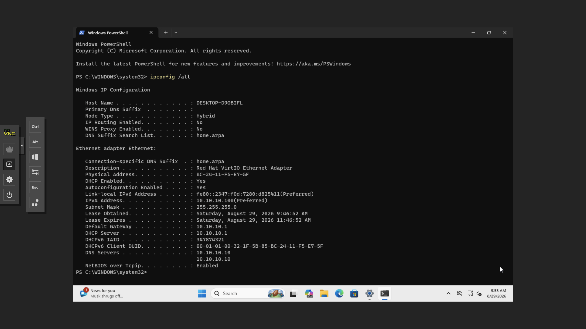
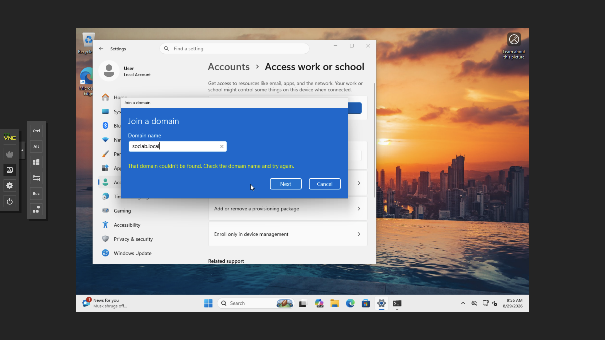
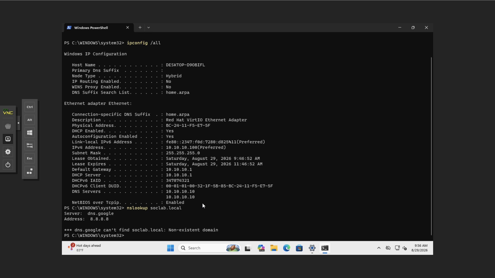
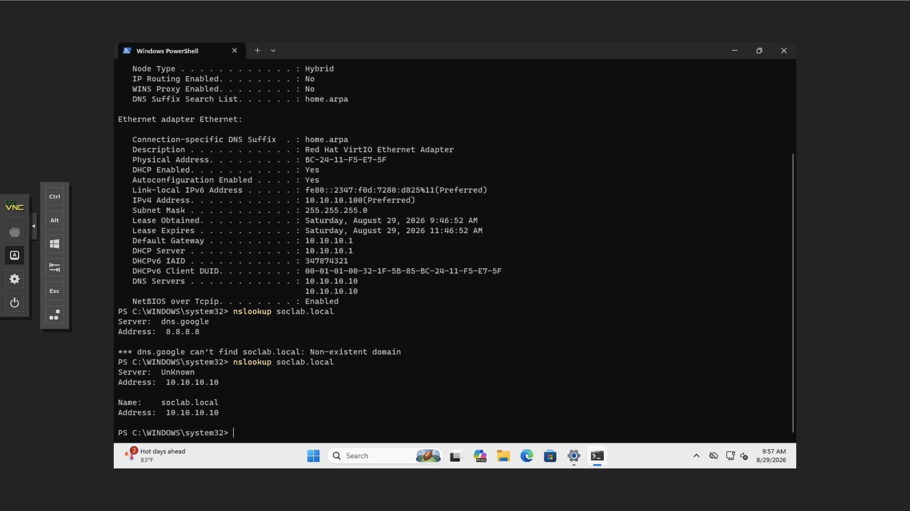
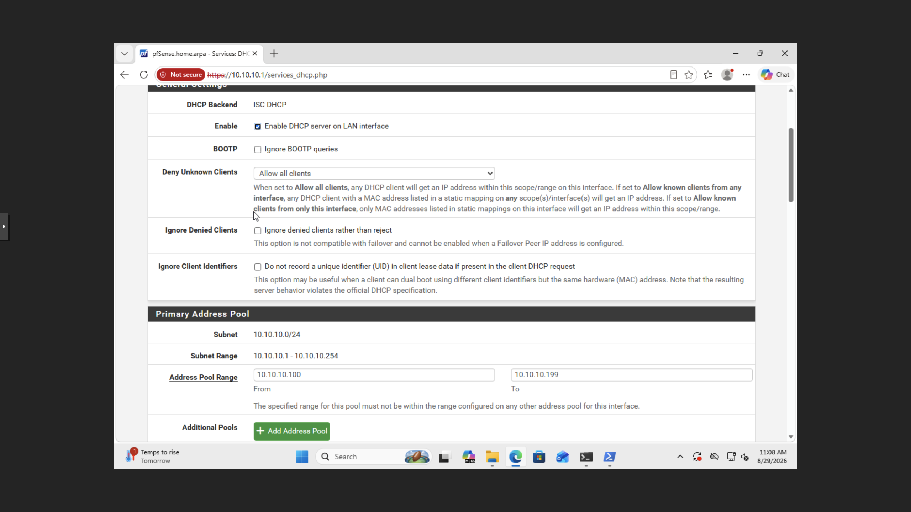
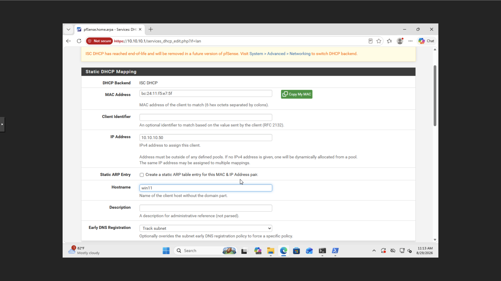
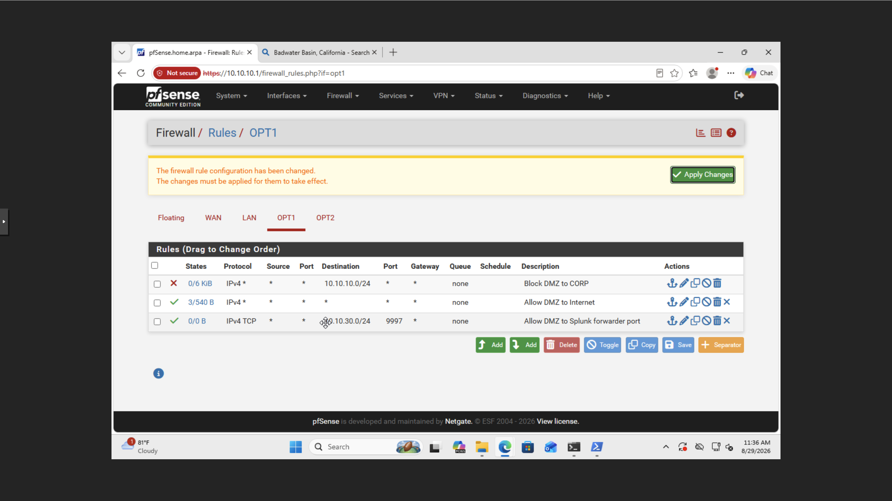
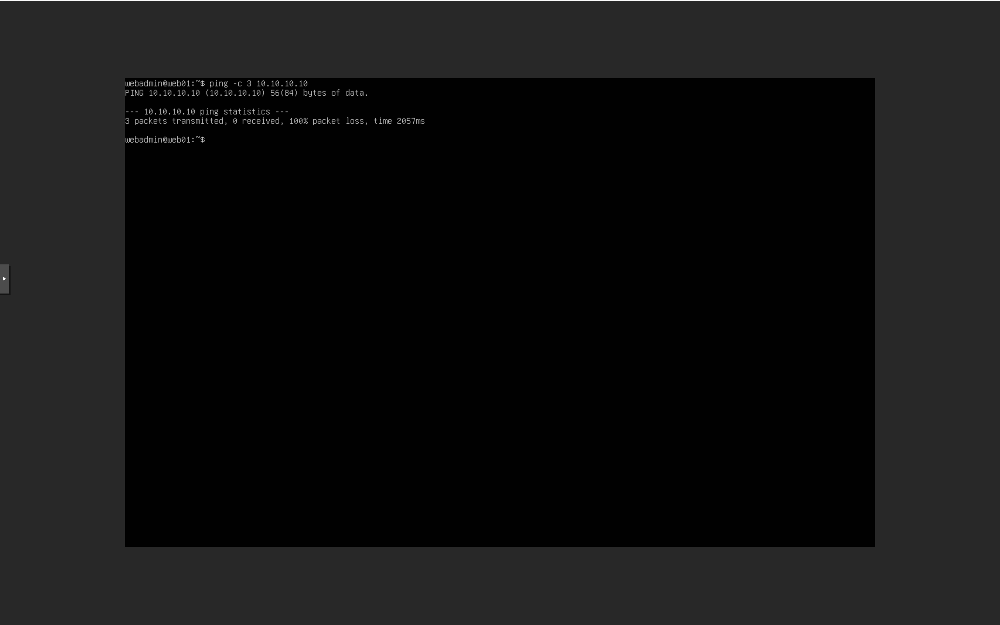
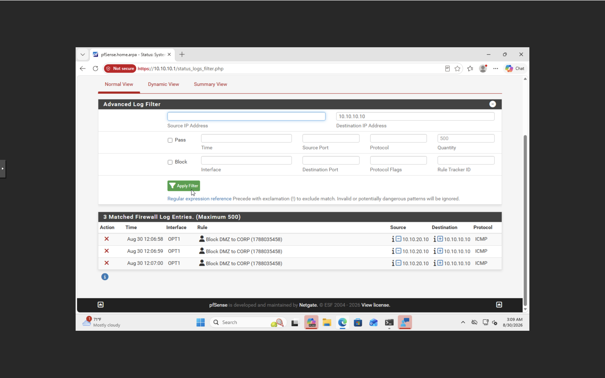
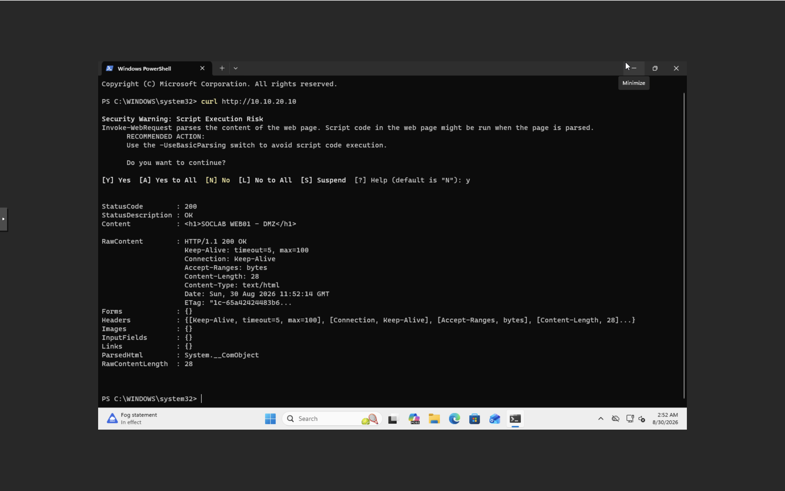

# Windows + Network Troubleshooting — Documentation Order

## Step 1 — Establish the client network baseline

## Step 2 — Reproduce a domain/DNS failure

## Step 3 — Diagnose name resolution

## Step 4 — Verify internal DNS resolution

This is a strong real troubleshooting sequence: failure -> investigation -> successful resolution.

## Step 5 — Document DHCP configuration

## Step 6 — Document firewall/segmentation policy

## Step 7 — Validate segmentation

## Step 8 — Validate allowed application traffic

The `setup-evidence/` folder contains the pfSense interface-assignment screenshot.